[English](./README.md) | Español

# ddubsOS 

Fecha del documento: 25 de noviembre de 2025

**ddubsOS** es un fork de **ZaneyOS**. Esta es la configuración que uso a diario
en mis sistemas: torres, portátiles y máquinas virtuales.

> 📣 ¡La wiki de ddubsOS está disponible (Inglés/Español)!

- 🌐 Wiki: https://gitlab.com/dwilliam62/ddubsos/-/wikis/home
- 📘 Biblioteca de chuletas: cheatsheets/README.es.md | [English](cheatsheets/README.md)
- ❓ FAQ: FAQ.es.md | FAQ.md
- 🤝 Contribuir: CONTRIBUTING.es.md | CONTRIBUTING.md
- 📏 Código de conducta: CODE_OF_CONDUCT.es.md | CODE_OF_CONDUCT.md

## ✨ Funciones y adiciones

He añadido muchos paquetes y funciones que no están en ZaneyOS. A algunos les
puede parecer cargado, pero con este fork estoy aprendiendo a hacer que
**NixOS** haga lo que quiero.

La barra predeterminada es `waybar`. `Hyprpanel` está disponible y puedes habilitarlo si lo prefieres.

- IMPORTANTE: Nueva [biblioteca de chuletas](cheatsheets/README.md):
  documentación centralizada y legible para herramientas y aspectos de ddubsOS.
- IMPORTANTE: [FAQ](FAQ.md): respuestas y consejos completos.

## 🧰 Herramientas instaladas y mejoras

- **Gestor de ventanas:** Plugins de Hyprland, scratchpad de pyprland, Wayfire
- **Entorno de escritorio:** GNOME y BSPWM ## Actualmente deshabilitado, en
  re-trabajo ##
- **Varios editores:** NeoVim configurado con NVF, Evil Helix, VS Code; este
  último con plugins y LSPs instalados
- **Terminales:** Kitty, WezTerm, Ghostty, Foot; todos configurados y con tema
- **Shell:** ZSH por defecto, BASH y Fish
- **Fondos de pantalla:** Tengo unos ~400 MB de fondos (WebP)

## 🧩 Configuración modular

Esta configuración está pensada para ser **modular**. Módulos dedicados de Nix
proporcionan configuraciones personalizadas para paquetes como:

- VS Code, Helix, Fish, Foot, Kitty, WezTerm, Ghostty y más

Este proyecto sigue evolucionando mientras refino mi configuración. Hasta que
haya una rama estable, las cosas pueden cambiar (o romperse) a menudo. 🚀

Siéntete libre de hacer un fork y adaptarlo. Si prefieres algo más ligero,
ZaneyOS puede ser mejor para ti.

<p align="center">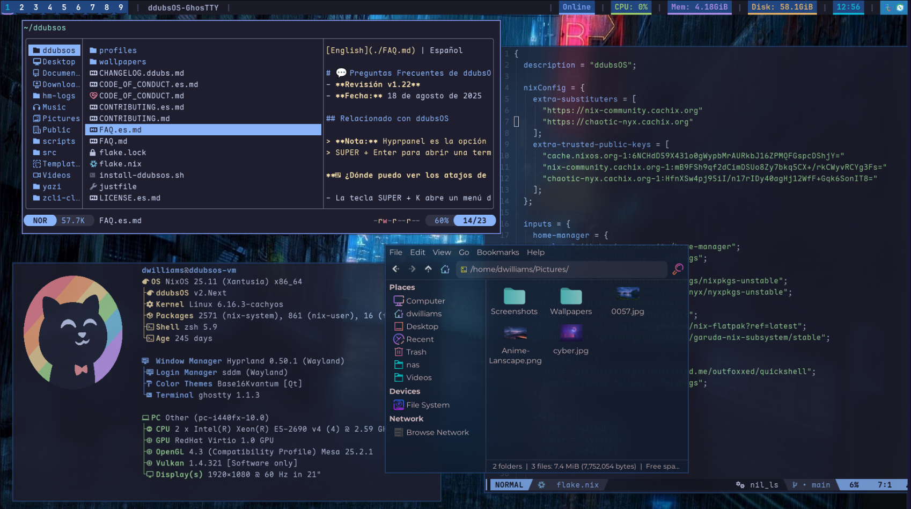</p>

<details>
<summary><h2>Más capturas de pantalla</h2></summary>


**Inspiración para la configuración de Waybar
[aquí](https://github.com/justinlime/dotfiles).**


**Tercera opción de waybar**


**Visor de chuletas (qs-cheatsheets) y menú de atajos**

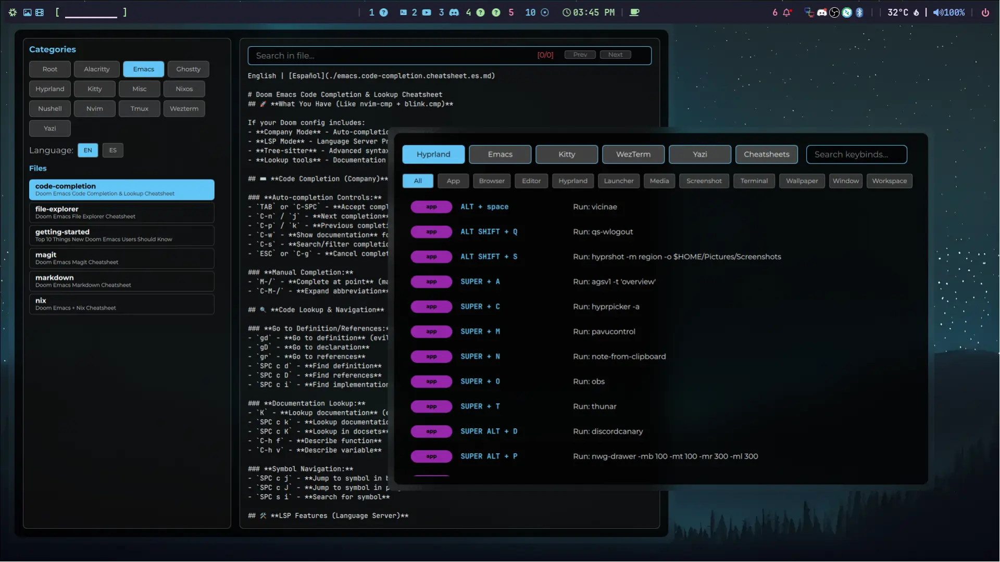

**Escritorio con fastfetch y gestor de archivos Yazi**

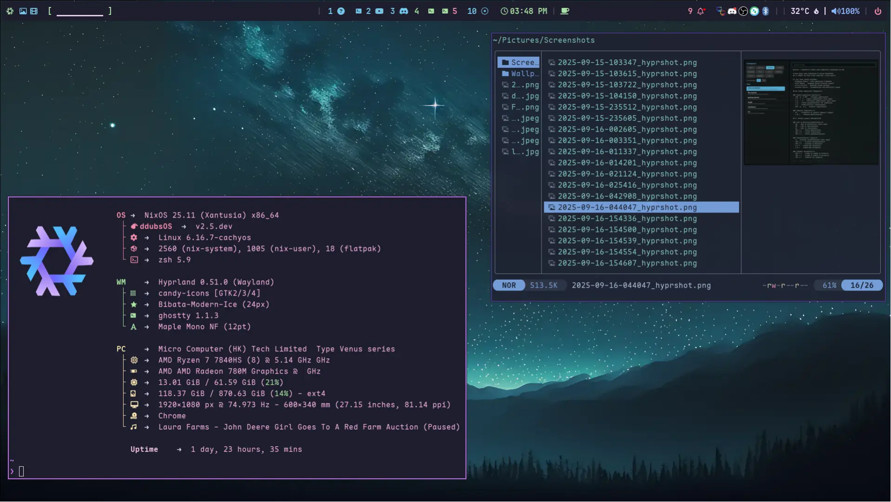

**Visor de documentación técnica (qs-docs)**

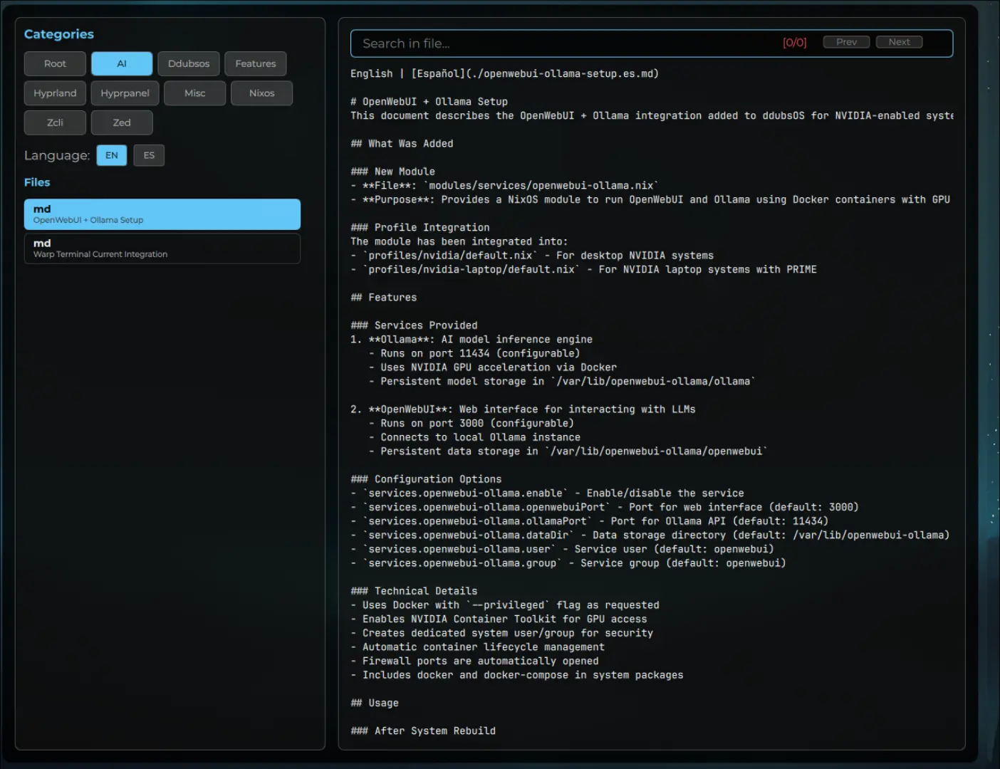

**Menú interactivo de atajos (qs-keybinds)**

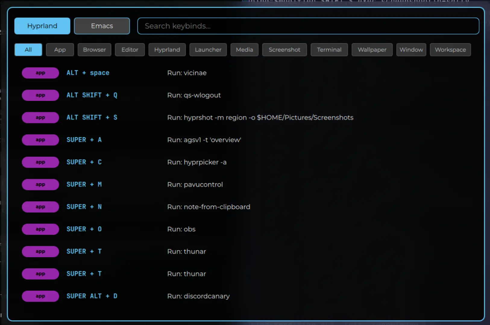

**fastfetch con menú de selección de fondos y video fondos**

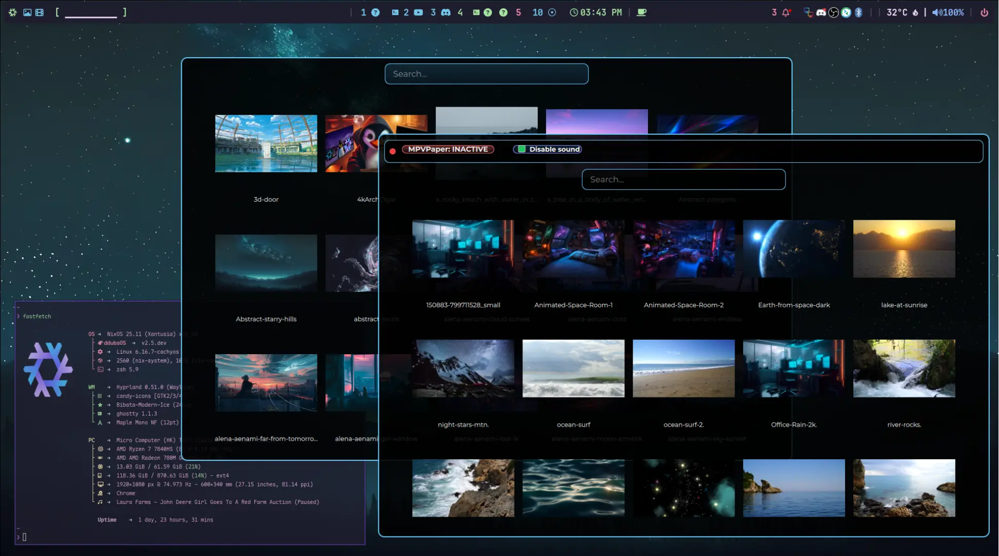

**Menú de configuración de terminal Kitty**

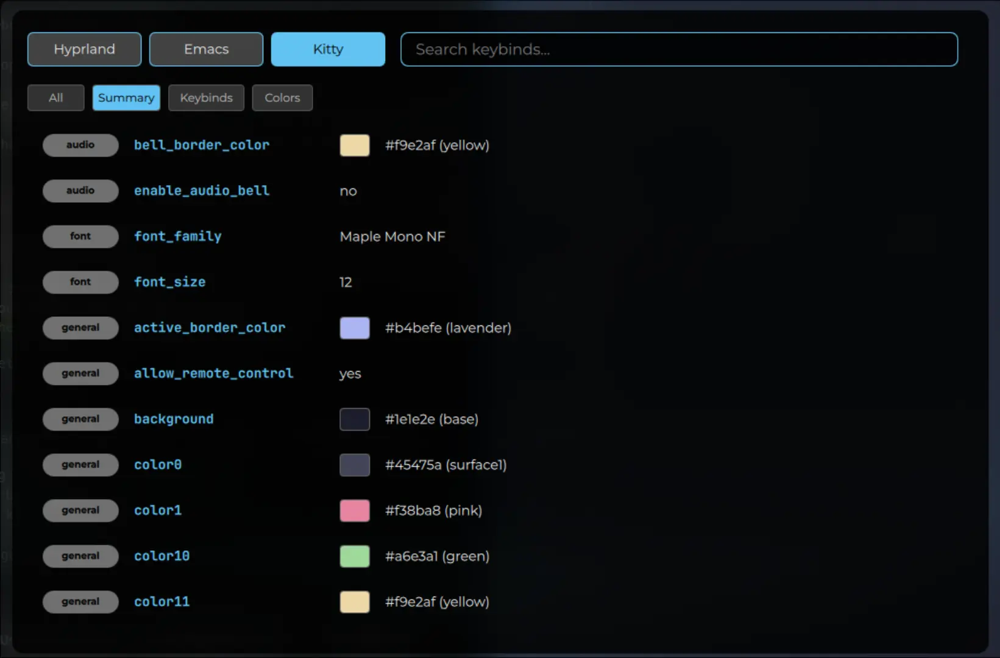

**Gestor de archivos Yazi con visor de chuletas**

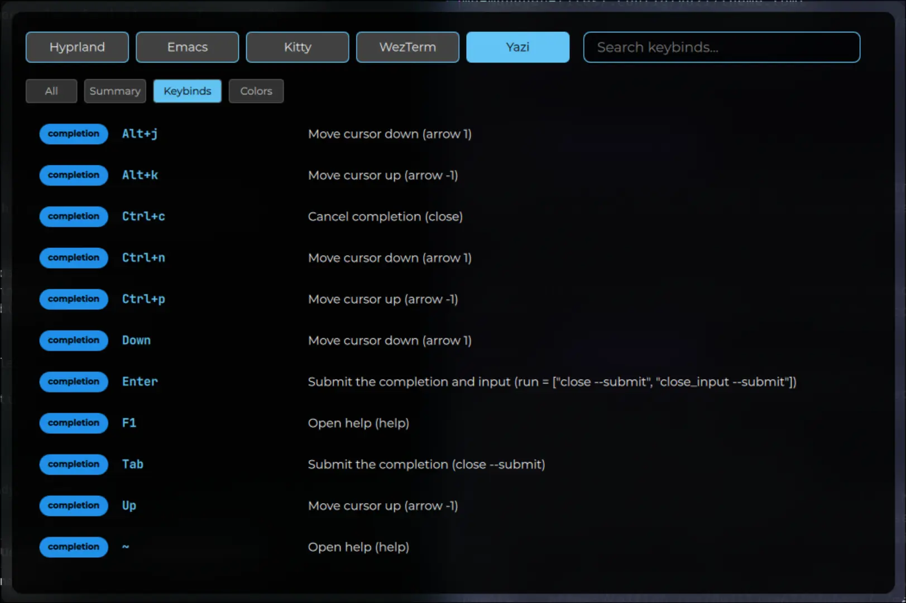

</details>

## 📚 Documentación

- Wiki: [ddubsOS Wiki](https://gitlab.com/dwilliam62/ddubsos/-/wikis/home)
- Biblioteca de chuletas: [Español](cheatsheets/README.es.md) | [English](cheatsheets/README.md)
- README: Español | [English](./README.md)
- Biblioteca de chuletas: [Español](cheatsheets/README.es.md) | [English](cheatsheets/README.md)
- FAQ: [Español](FAQ.es.md) | [English](FAQ.md)
- Contribuir: [Español](CONTRIBUTING.es.md) | [English](CONTRIBUTING.md)
- Código de conducta: [Español](CODE_OF_CONDUCT.es.md) | [English](CODE_OF_CONDUCT.md)
- Licencia: [English](LICENSE.md)
- devenv-usage: [English](docs/devenv-usage.md) | [Español](docs/devenv-usage.es.md)
- openwebui-ollama-setup: [English](docs/openwebui-ollama-setup.md) | [Español](docs/openwebui-ollama-setup.es.md)
- project-guide: [English](docs/project-guide.md) | [Español](docs/project-guide.es.md)
- zcli: [English](docs/zcli.md) | [Español](docs/zcli.es.md)

### 🆕 Agregar host en flake.nix

- Salidas de flake por host junto con las salidas por perfil
  - Compilar por host (preferido):
    - sudo nixos-rebuild switch --flake .#<host>
  - Compilar por perfil (legado sigue disponible):
    - sudo nixos-rebuild switch --flake .#<profile> # amd | intel | nvidia |
      nvidia-laptop | vm
- Indicadores del instalador
  - ./install-ddubsos.sh --host <nombre> --profile
    <amd|intel|nvidia|nvidia-laptop|vm> --build-host --non-interactive
  - --host/--profile preseleccionan valores; --build-host compila el destino
    .#<host>; --non-interactive acepta valores por defecto sin preguntas
- Gestión de hosts con ZCLI
  - zcli add-host <nombre> [perfil]
  - zcli del-host <nombre>
  - zcli rename-host <antiguo> <nuevo>
  - zcli hostname set <nombre>
  - zcli update-host [nombre] [perfil] # auto-detecta o establece explícitamente
    en flake.nix
- Guías
  - Actualización: docs/upgrade-from-2.4.md
  - Estado: docs/ddubos-refactor-status.md
  - Plan de pruebas: docs/ddubos-refactor-testplan.md

#### 🍖 Requisitos

- Debes estar en NixOS, versión 23.11+ (se recomienda 25.05+).
- Se espera que la carpeta `ddubsos` (este repo) esté en tu directorio home.
- Debes haber instalado NixOS con particionado **GPT** y arranque **UEFI**.
- ** Se requiere partición /boot de mínimo 1 GB. **
- Se soporta systemd-boot.
- Para GRUB tendrás que buscar una guía. ☺️
- Editar manualmente tus archivos específicos del host.
- El host es la máquina específica donde instalas.

#### 🎹 Controles de Pipewire y del centro de notificaciones

- Usamos la solución de audio más reciente para Linux. Tendrás controles de
  medios y volumen en el centro de notificaciones accesible en la barra
  superior.

#### 🏇 Flujo de trabajo optimizado y Neovim simple pero elegante

- Usando Hyprland y otros entornos, para mayor elegancia, funcionalidad y
  eficiencia.
- No es un proyecto masivo de Neovim. Es una configuración simple, fácil de
  entender y potente. Con soporte de lenguajes ya añadido.

#### 🖥️ Configuración multi-host

- Puedes definir ajustes separados para diferentes máquinas y usuarios.
- Especifica fácilmente paquetes extra para tus usuarios en
  `modules/core/global-packages.nix`.
- Estructura de archivos fácil de entender y configuración simple pero
  abarcadora.

## 📖 Hazte un favor — lee las [FAQ](FAQ.es.md) y la [Wiki](https://gitlab.com/dwilliam62/ddubsos/-/wikis/home)

#### 📦 ¿Cómo instalar paquetes?

- Puedes buscar en [Nix Packages](https://search.nixos.org/packages?) y
  [Options](https://search.nixos.org/options?) para saber el nombre de un
  paquete o si tiene opciones que resuelvan configuraciones.
- Para añadir un paquete, usa las secciones en
  `modules/core/global-packages.nix` y `hosts/<HOSTNAME>.nix/host-packages`. Una
  es para programas disponibles en todos los hosts y la otra para ese host.

#### 🙋 ¿Problemas o preguntas?

- Abre un issue en el repo; por favor etiqueta las solicitudes de función con
  [feature request] al inicio del título. ¡Gracias!
- Contáctanos en [Discord](https://discord.gg/2cRdBs8) para una respuesta
  potencialmente más rápida.

- No olvides revisar el [FAQ](FAQ.es.md)

# Atajos de Hyprland

Abajo están los atajos de Hyprland, formateados para consulta rápida.

## Lanzamiento de aplicaciones

- `$modifier + Return` → Lanzar `terminal`
- `$modifier + Shift + Return` → Lanzar `rofi-launcher`
- `$modifier + Tab` → Alternar `Quickshell Overview` (visor de espacios de trabajo con vistas en vivo)
- `$modifier + Shift + W` → Abrir `Selector de fondos`
- `$modifier + Shift + A` → Abrir `Menú de fondos animados`
- `$modifier + Alt + W` → Abrir `wallsetter`
- `$modifier + Shift + N` → Ejecutar `swaync-client -rs`
- `$modifier + W` → Lanzar `Web Browser`
- `$modifier + Y` → Abrir `kitty` con `yazi`
- `$modifier + E` → Abrir `emopicker9000`
- `$modifier + S` → Tomar captura de pantalla
- `$modifier + D` → Abrir `Discord`
- `$modifier + O` → Lanzar `OBS Studio`
- `$modifier + C` → Ejecutar `hyprpicker -a`
- `$modifier + G` → Abrir `GIMP`
- `$modifier + V` → Mostrar historial del portapapeles con `cliphist`
- `$modifier + T` → Conmutar terminal con `pypr`
- `$modifier + M` → Abrir `pavucontrol`

## Ayuda rápida y documentación

- `$modifier + Shift + K` → **qs-keybinds** - Visor interactivo de atajos
  - Navega todos los atajos de Hyprland, Emacs, Kitty, WezTerm y Yazi
  - Soporte multi-modo con búsqueda y filtrado en tiempo real
  - Clic en cualquier atajo para copiarlo al portapapeles con notificación
- `$modifier + Shift + C` → **qs-cheatsheets** - Navegador de chuletas
  - Acceso a chuletas completas para Emacs, terminales, Hyprland y más
  - Soporte multi-idioma (Inglés/Español) con selección de archivos
  - Categorías: emacs, hyprland, kitty, wezterm, yazi, nixos
- `$modifier + Shift + D` → **qs-docs** - Visor de documentación técnica
  - Navega documentación técnica de ddubsOS desde `~/ddubsos/docs/`
  - Guías de arquitectura, instrucciones de instalación y documentación de desarrollo
  - Búsqueda inteligente y navegación por archivos de documentación

## Gestión de ventanas

- `$modifier + Q` → Cerrar ventana activa
- `$modifier + P` → Alternar pseudo tiling
- `$modifier + Shift + I` → Alternar modo dividido
- `$modifier + F` → Alternar pantalla completa
- `$modifier + Shift + F` → Alternar flotante
- `$modifier + Alt + F` → Alternar Pantalla Completa 1
- `$modifier + SPACE` → Flotar ventana actual
- `$modifier + Shift + SPACE` → Flotar todas las ventanas

## Movimiento de ventanas

- `$modifier + Shift + ← / → / ↑ / ↓` → Mover ventana izq./der./arriba/abajo
- `$modifier + Shift + H / L / K / J` → Mover ventana izq./der./arriba/abajo
- `$modifier + Alt + ← / → / ↑ / ↓` → Intercambiar ventana
  izq./der./arriba/abajo
- `$modifier + Alt + 43 / 46 / 45 / 44` → Intercambiar ventana
  izq./der./arriba/abajo

## Movimiento de foco

- `$modifier + ← / → / ↑ / ↓` → Mover foco izq./der./arriba/abajo
- `$modifier + H / L / K / J` → Mover foco izq./der./arriba/abajo

## Espacios de trabajo

- `$modifier + 1-10` → Cambiar al espacio 1-10
- `$modifier + Shift + Space` → Mover ventana al espacio especial
- `$modifier + Space` → Conmutar espacio especial
- `$modifier + Shift + 1-10` → Mover ventana al espacio 1-10
- `$modifier + Control + → / ←` → Cambiar espacio adelante/atrás

## Ciclo de ventanas

- `Alt + Tab` → Siguiente ventana
- `Alt + Tab` → Traer ventana activa al frente

## Instalación:

<details>
<summary><strong> ⬇️ Instalar con script </strong></summary>

### 📜 Script:

Es la forma más fácil y recomendada de empezar. El script no pretende permitirte
cambiar todas las opciones del flake ni instalar paquetes extra. Solo está para
instalar mi configuración con el menor riesgo de roturas y que luego puedas
ajustar a tu gusto.

Copia y ejecuta esto:

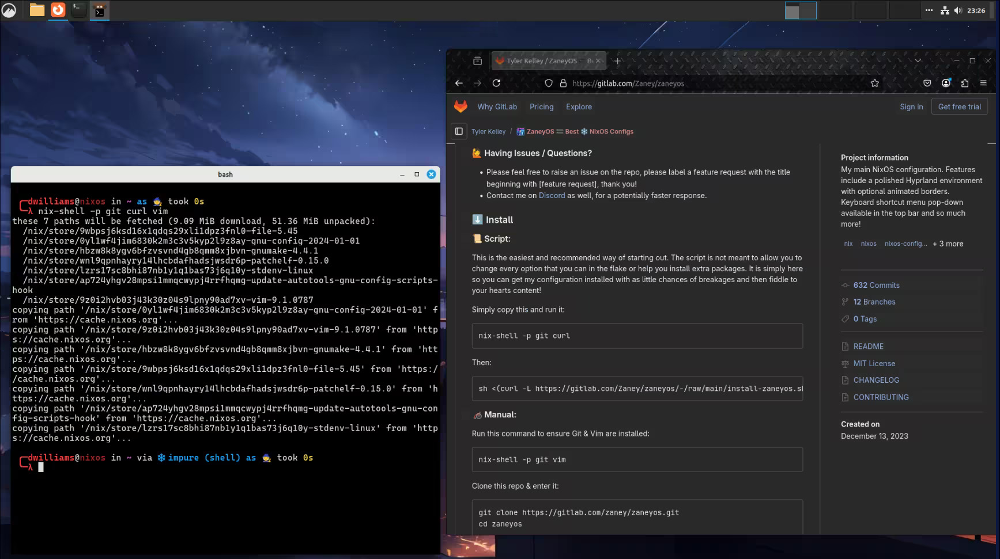

```
nix-shell -p git curl wget vim pciutils
```

Luego:

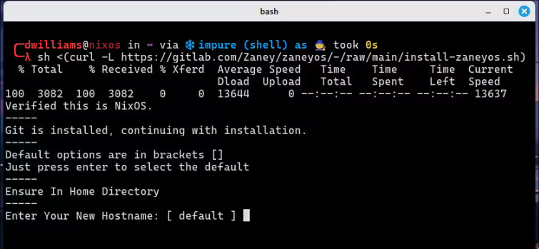

```
sh <(curl -L https://gitlab.com/dwilliam62/ddubsos/-/raw/main/install-ddubsos.sh)
```

#### El proceso de instalación se verá así:

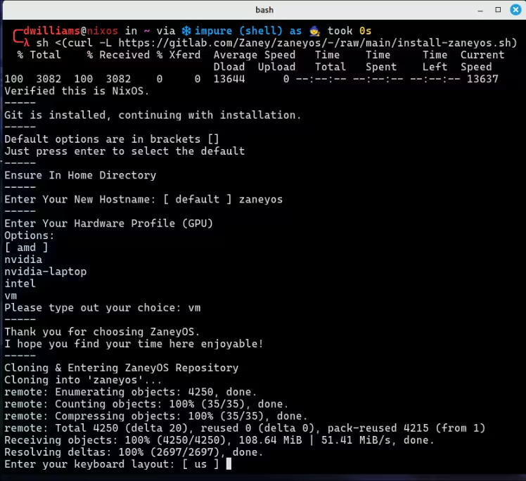

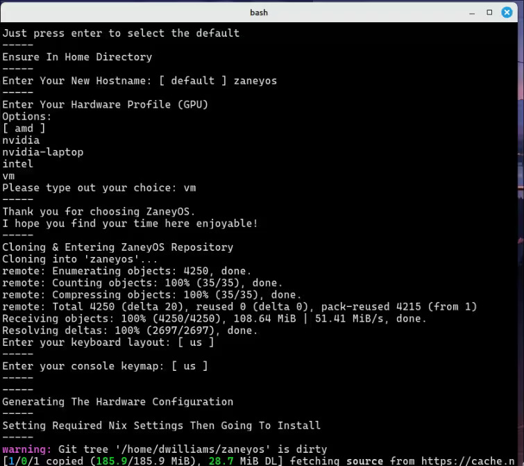

#### Tras completar la instalación, tu entorno puede verse roto. Reinicia y verás esto como pantalla de inicio de sesión:

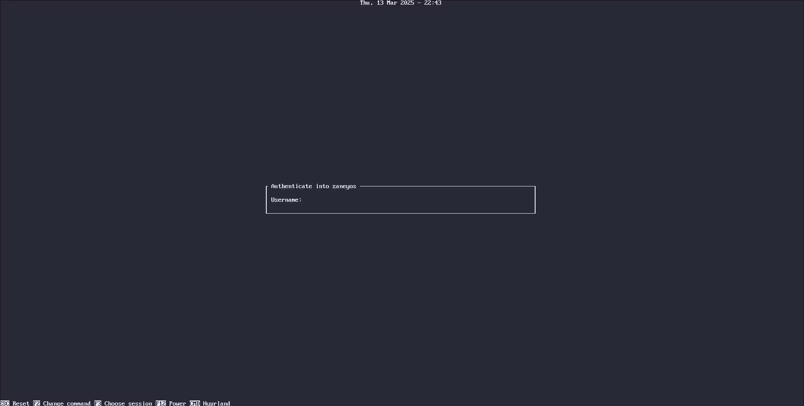

#### Después de iniciar sesión deberías ver una pantalla como esta:

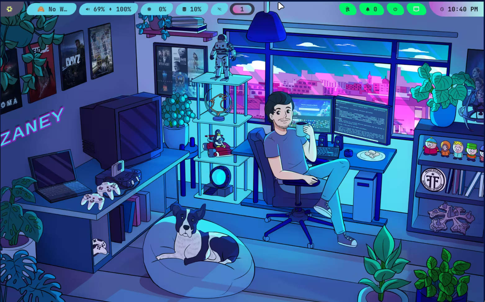

</details>

<details>
<summary><strong> 🦽 Proceso de instalación manual: </strong></summary>

1. Ejecuta este comando para asegurar Git y Vim:

```
nix-shell -p git curl wget vim pciutils
```

2. Clona este repo y entra:

```
cd && git clone https://gitlab.com/dwilliam62/ddubsos --depth=1 ~/ddubsos
cd ddubsos
```

- _Permanece en esta carpeta el resto de la instalación_

3. Crea la carpeta del host para tu(s) máquina(s):

```
cp -r hosts/default hosts/<tu-hostname>
git add .
```

4. Edita `hosts/<tu-hostname>/variables.nix`.

5. Edita `flake.nix` y rellena tu usuario, perfil (GPU) y hostname.

6. Genera tu hardware.nix así:

```
nixos-generate-config --show-hardware-config > hosts/<tu-hostname>/hardware.nix
```

7. Ejecuta esto para habilitar flakes e instalar la flake, reemplazando hostname
   con lo que pusiste:

```
NIX_CONFIG="experimental-features = nix-command flakes"
sudo nixos-rebuild switch --flake .#profile
    - (`profile` es tu GPU: amd, intel, nvidia, nvidia-laptop, vm)
```

Ahora, cuando quieras reconstruir la configuración, tienes el alias `fr` que
reconstruye la flake sin estar en la carpeta `zaneyos`.

</details>

### Reconocimientos especiales:

Gracias por toda su ayuda

- Zaney https://gitlab.com/zaney
- Jakoolit https://github.com/jakoolit
- Justaguylinux https://codeberg.org/justaguylinux
- Jerry Starke https://github.com/JerrySM64
- Redbeardymcgee
- iynaix

## ¡Espero que lo disfrutes!
