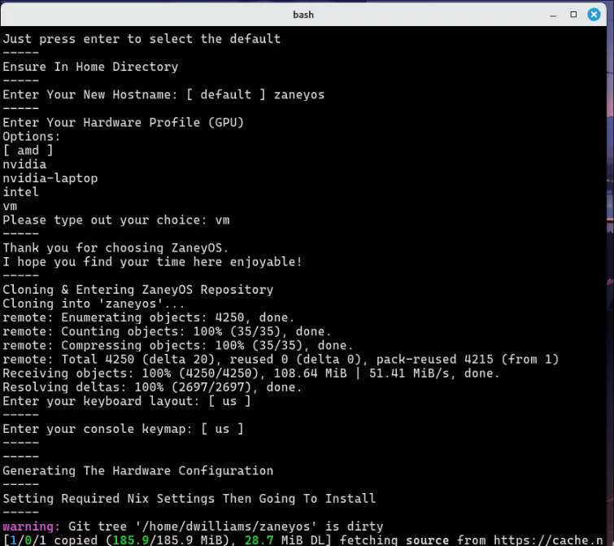

English | [Español](./README.es.md)

<div align="center">

# ddubsOS -- v2.5

Document Date: September 10th, 2025

**ddubsOS** is a fork of **ZaneyOS**. This is the configuration I use on my
systems every day—from towers, laptops, and VMs.

📣 New: The ddubsOS Wiki is live!

- Browse the wiki (English/Spanish): https://github.com/dwilliam62/ddubsos-wiki
- Cheatsheets index:
  https://github.com/dwilliam62/ddubsos-wiki/blob/main/Cheatsheets.md

## Features & Additions

I have added a lot of packages and features not found in ZaneyOS. Some may find
it bloated, but this fork is how I am learning to make **NixOS** do what I want.
I am also defaulting to `Hyprpanel` vs. `waybar` But the waybar config files are
still there and Hyprpanel can be disabled in favor of waybar

- IMPORTANT: New [Cheatsheets Library](cheatsheets/README.md) — centralized,
  human-friendly docs for tools and ddubsOS specifics. English |
  [Español](cheatsheets/README.es.md)
- IMPORTANT: [FAQ](FAQ.md) — comprehensive answers and tips. English |
  [Español](FAQ.es.md)

## Documentation

- Wiki: [ddubsOS Wiki](https://github.com/dwilliam62/ddubsos-wiki) | Cheatsheets
  index: https://github.com/dwilliam62/ddubsos-wiki/blob/main/Cheatsheets.md
- README: English | [Español](./README.es.md)
- Cheatsheets Library: [English](cheatsheets/README.md) |
  [Español](cheatsheets/README.es.md)
- FAQ: [English](FAQ.md) | [Español](FAQ.es.md)
- Contributing: [English](CONTRIBUTING.md) | [Español](CONTRIBUTING.es.md)
- Code of Conduct: [English](CODE_OF_CONDUCT.md) |
  [Español](CODE_OF_CONDUCT.es.md)
- License: [English](LICENSE.md) | [Español](LICENSE.es.md)
- devenv-usage: [English](docs/devenv-usage.md) |
  [Español](docs/devenv-usage.es.md)
- openwebui-ollama-setup: [English](docs/openwebui-ollama-setup.md) |
  [Español](docs/openwebui-ollama-setup.es.md)
- project-guide: [English](docs/project-guide.md) |
  [Español](docs/project-guide.es.md)
- zcli: [English](docs/zcli.md) | [Español](docs/zcli.es.md)

### New in refactor branch (ddubos-refactor)

- Host-based flake outputs alongside legacy profile outputs
  - Build by host (preferred):
    - sudo nixos-rebuild switch --flake .#<host>
  - Build by profile (legacy remains available):
    - sudo nixos-rebuild switch --flake .#<profile> # amd | intel | nvidia |
      nvidia-laptop | vm
- Installer flags
  - ./install-ddubsos.sh --host <name> --profile
    <amd|intel|nvidia|nvidia-laptop|vm> --build-host --non-interactive
  - --host/--profile preselect values; --build-host builds the .#<host> target;
    --non-interactive accepts defaults without prompts
- ZCLI host management
  - zcli add-host <name> [profile]
  - zcli del-host <name>
  - zcli rename-host <old> <new>
  - zcli hostname set <name>
  - zcli update-host [name] [profile] # auto-detect or set explicitly in
    flake.nix
- Guides
  - Upgrade: docs/upgrade-from-2.4.md
  - Status: docs/ddubos-refactor-status.md
  - Test plan: docs/ddubos-refactor-testplan.md

### Installed Tools & Enhancements

- **Window Manager:** Hyprland Plugins, pyprland scratchpad, Wayfire
- **Desktop Environment:** GNOME, and BSPWM ## Currently disabled, being
  reworked ##
- **Multiple Editors:** NeoVim configured with NVF, Evil Helix, vscode, the
  later with plugins, LSPs installed
- **Terminals:** Kitty, WezTerm, Ghostty, Foot, all configured, and themed
- **Shell:** ZSH as default, BASH, and Fish
- **Wallpapers:** I have about 500MB of wallpapers

### Modular Configurations

I aimed to make the setup **modular**. There is a **Nix configuration file** for
packages that need custom configurations, including:

- vscode, helix, Fish, foot, kitty, wezterm, Ghostty and more

This project is evolving as I continue to refine my setup. Until I build a
stable branch, this config will change (break?) often. 🚀

Feel free to fork it and make it your own. Or you might find the more slimmed
down config of ZaneyOS more to your liking.


</div>

<details>
<summary><h2>More Screenshots</h2></summary>


**Inspiration for the Waybar config
[here](https://github.com/justinlime/dotfiles).**


**Third waybar option**


**qs-cheatsheets and keybinds menu viewer**


**Desktop with fastfetch and Yazi file manager**


**qs-docs technical documentation viewer**


**Interactive keybinds menu (qs-keybinds)**


**fastfetch with wallpaper and video wallpaper selection menu**


**Kitty terminal configuration menu**


**Yazi file manager with cheatsheet viewer**


</details>

### Wiki

The ddubsOS Wiki is now available (English/Spanish):

- https://github.com/dwilliam62/ddubsos-wiki

#### 🍖 Requirements

- You must be running on NixOS, version 23.11+. (25.05+ recommended)
- The `ddubsos` folder (this repo) is expected to be in your home directory.
- You must have installed NIXOS using **GPT** parition with booting with
  **UEFI**.
- ** 500MB minimum /boot parititon required. **
- Systemd-boot is what is supported
- For GRUB you will have to brave the internet for a how-to. ☺️
- Manually editing your host specific files.
- The host is the specific computer your installing on.

#### 🎹 Pipewire & Notification Menu Controls

- We are using the latest and greatest audio solution for Linux. Not to mention
  you will have media and volume controls in the notification center available
  in the top bar.

#### 🏇 Optimized Workflow & Simple Yet Elegant Neovim

- Using Hyprland and other environments, for increased elegance, functionality,
  and efficiency.
- No massive Neovim project here. This is a simple, easy to understand, yet
  incredible Neovim setup. With language support already added in.

#### 🖥️ Multi Host Configuration

- You can define separate settings for different host machines and users.
- Easily specify extra packages for your users in the
  `modules/core/global-packages.nix` file.
- Easy to understand file structure and simple, but encompassing, configuration.

<div align="center">

Please do yourself a favor and
[read the wiki](https://zaney.org/wiki/zaneyos-2.3/).

</div>

#### 📦 How To Install Packages?

- You can search the [Nix Packages](https://search.nixos.org/packages?) &
  [Options](https://search.nixos.org/options?) pages for what a package may be
  named or if it has options available that take care of configuration hurdles
  you may face.
- To add a package there are the sections for it in
  `modules/core/global-packages.nix` and `hosts/<HOSTNAME>.nix/host-packages`.
  One is for programs available to all hosts, and the other specific to that
  host.

#### 🙋 Having Issues / Questions?

- Please feel free to raise an issue on the repo, please label a feature request
  with the title beginning with [feature request], thank you!
- Contact us on [Discord](https://discord.gg/2cRdBs8) as well, for a potentially
  faster response.

- Don't forget to checkout the [FAQ](https://zaney.org/wiki/zaneyos-2.3/faq)

# Hyprland Keybindings

Below are the keybindings for Hyprland, formatted for easy reference.

## Application Launching

- `$modifier + Return` → Launch `terminal`
- `$modifier + Shift + Return` → Launch `rofi-launcher`
- `$modifier + Shift + W` → Open `Wallpaper Picker`
- `$modifier + Shift + A` → Open `Animated Wallpaper Menu`
- `$modifier + Alt + W` → Open `wallsetter`
- `$modifier + Shift + N` → Run `swaync-client -rs`
- `$modifier + W` → Launch `Web Browser`
- `$modifier + Y` → Open `kitty` with `yazi`
- `$modifier + E` → Open `emopicker9000`
- `$modifier + S` → Take a screenshot
- `$modifier + D` → Open `Discord`
- `$modifier + O` → Launch `OBS Studio`
- `$modifier + C` → Run `hyprpicker -a`
- `$modifier + G` → Open `GIMP`
- `$modifier + V` → Show clipboard history via `cliphist`
- `$modifier + T` → Toggle terminal with `pypr`
- `$modifier + M` → Open `pavucontrol`

## Quick-Select Help & Documentation

- `$modifier + Shift + K` → **qs-keybinds** - Interactive keybindings viewer
  - Browse all Hyprland, Emacs, Kitty, WezTerm, and Yazi keybindings
  - Multi-mode support with real-time search and filtering
  - Click any keybind to copy it to clipboard with notification
- `$modifier + Shift + C` → **qs-cheatsheets** - Cheatsheets browser
  - Access comprehensive cheatsheets for Emacs, terminals, Hyprland, and more
  - Multi-language support (English/Spanish) with file selection
  - Categories include: emacs, hyprland, kitty, wezterm, yazi, nixos
- `$modifier + Shift + D` → **qs-docs** - Technical documentation viewer
  - Browse ddubsOS technical documentation from `~/ddubsos/docs/`
  - Architecture guides, setup instructions, and development documentation
  - Intelligent search and navigation through documentation files

## Window Management

- `$modifier + Q` → Kill active window
- `$modifier + P` → Toggle pseudo tiling
- `$modifier + Shift + I` → Toggle split mode
- `$modifier + F` → Toggle fullscreen
- `$modifier + Shift + F` → Toggle floating mode
- `$modifier + Alt + F` → Toggle Fullscreen 1
- `$modifier + SPACE` → Float current window
- `$modifier + Shift + SPACE` → Float all windows

## Window Movement

- `$modifier + Shift + ← / → / ↑ / ↓` → Move window left/right/up/down
- `$modifier + Shift + H / L / K / J` → Move window left/right/up/down
- `$modifier + Alt + ← / → / ↑ / ↓` → Swap window left/right/up/down
- `$modifier + Alt + 43 / 46 / 45 / 44` → Swap window left/right/up/down

## Focus Movement

- `$modifier + ← / → / ↑ / ↓` → Move focus left/right/up/down
- `$modifier + H / L / K / J` → Move focus left/right/up/down

## Workspaces

- `$modifier + 1-10` → Switch to workspace 1-10
- `$modifier + Shift + Space` → Move window to special workspace
- `$modifier + Space` → Toggle special workspace
- `$modifier + Shift + 1-10` → Move window to workspace 1-10
- `$modifier + Control + → / ←` → Switch workspace forward/backward

## Window Cycling

- `Alt + Tab` → Cycle to next window
- `Alt + Tab` → Bring active window to top

## Installation:

<details>
<summary><strong> ⬇️ Install with script </strong></summary>

### 📜 Script:

This is the easiest and recommended way of starting out. The script is not meant
to allow you to change every option that you can in the flake or help you
install extra packages. It is simply here so you can get my configuration
installed with as little chances of breakages and then fiddle to your hearts
content!

Simply copy this and run it:


```
nix-shell -p git curl wget vim pciutils
```

Then:


```
sh <(curl -L https://gitlab.com/dwilliam62/ddubsos/-/raw/bae85cf9eded4a2b7096fad78ea7bcafca514846/install-ddubsos.sh)
```

#### The install process will look something like this:




#### After the install completes your environment will probably look broken. Just reboot and you will see this as your login:


#### Then after login you should see a screen like this:


</details>

<details>
<summary><strong> 🦽 Manual install process:  </strong></summary>

1. Run this command to ensure Git & Vim are installed:

```
nix-shell -p git curl wget vim pciutils
```

2. Clone this repo & enter it:

```
cd && git clone https://gitlab.com/dwilliam62/ddubsos --depth=1 ~/ddubsos
cd ddubsos
```

- _You should stay in this folder for the rest of the install_

3. Create the host folder for your machine(s) like so:

```
cp -r hosts/default hosts/<your-desired-hostname>
git add .
```

4. Edit `hosts/<your-desired-hostname>/variables.nix`.

5. Edit `flake.nix` and fill in your username, profile (gpu), and hostname.

6. Generate your hardware.nix like so:

```
nixos-generate-config --show-hardware-config > hosts/<your-desired-hostname>/hardware.nix
```

7. Run this to enable flakes and install the flake replacing hostname with
   whatever you put as the hostname:

```
NIX_CONFIG="experimental-features = nix-command flakes" 
sudo nixos-rebuild switch --flake .#profile 
    - (`profile` is your GPU. amd, intel, nvidia, nvidia-laptop, vm)
```

Now when you want to rebuild the configuration you have access to an alias
called `fr` that will rebuild the flake and you do not have to be in the
`zaneyos` folder for it to work.

</details>

### Special Recognitions:

Thank you for all your assistance

- Zaney https://gitlab.com/zaney
- Jakoolit https://github.com/jakoolit
- Justaguylinux https://github.com/drewgrif
- Jerry Starke https://github.com/JerrySM64
- Redbeardymcgee
- iynaix

## Hope you enjoy!
